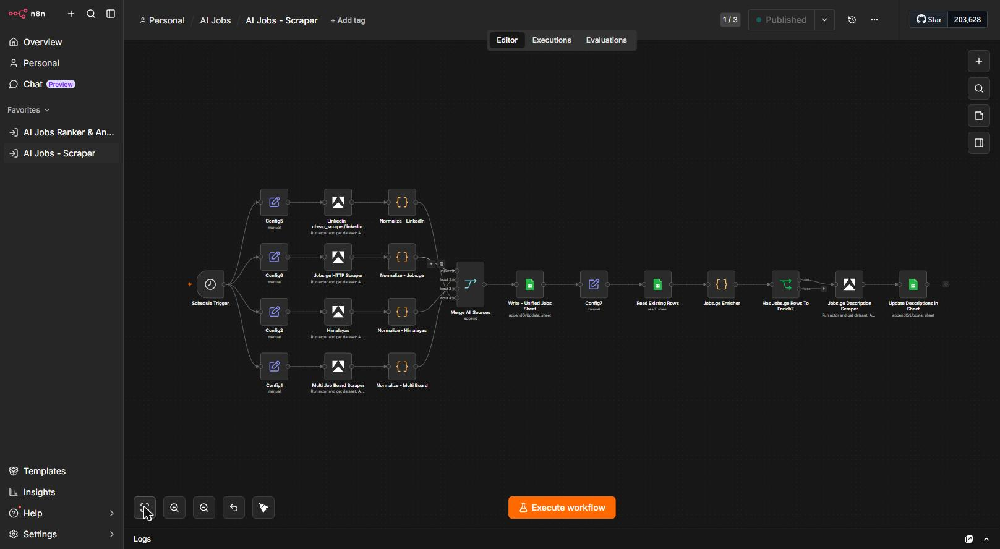
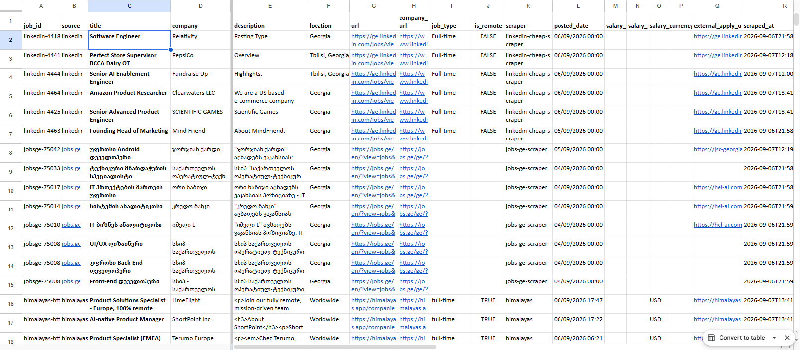
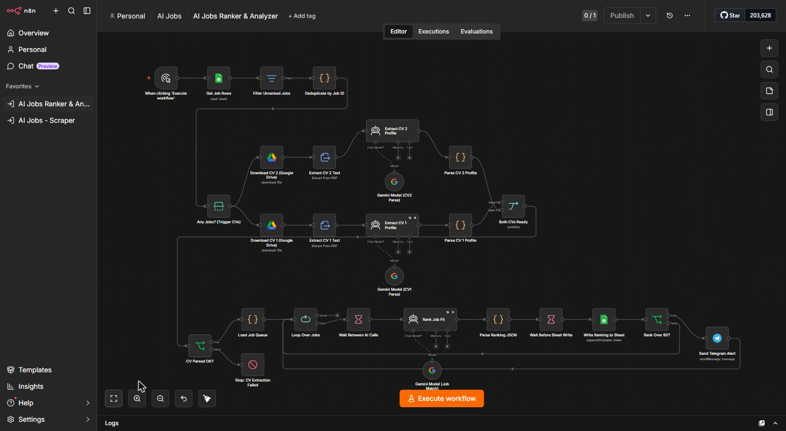
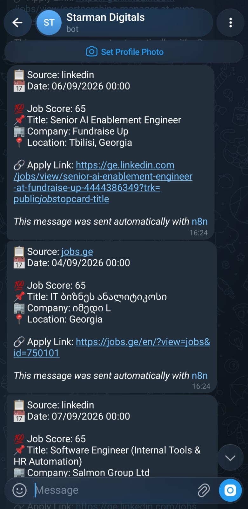

# 🤖 AI Job Hunter — n8n Workflows

Automated job-hunting pipeline built on [n8n](https://n8n.io/): it scrapes job listings from multiple sources, keeps them deduplicated in a Google Sheet, then uses Google Gemini to read your CV(s), score every job against your actual profile, and ping you on Telegram the moment a strong match shows up.

Two workflows, one pipeline:

1. **AI Jobs – Scraper** — pulls fresh listings from LinkedIn, Jobs.ge, Himalayas, and other boards into a single Google Sheet.
2. **AI Jobs Ranker & Analyzer** — reads your CV(s), ranks every unranked job against your profile with an LLM, and alerts you when something scores high.

---

## 🧠 Overview

Job hunting manually across five different sites and re-reading the same postings is a waste of time. This project automates the boring 90%:

- **Collect** — several scrapers run on a schedule and normalize results from different sources into one schema.
- **Deduplicate & store** — everything lands in a single Google Sheet acting as the job database.
- **Understand you** — your CV(s) are parsed once by an LLM into a structured profile (skills, experience, seniority, etc.).
- **Rank** — every new job is scored against that profile by an AI agent, with the reasoning written back to the sheet.
- **Alert** — jobs above a score threshold trigger an instant Telegram notification, so you only look at what's worth applying to.

---

## 📸 Screenshots

### Workflow 1 — AI Jobs Scraper

<a href="screenshots/ai-jobs-scraper-workflow.jpg"></a>

**Result — the Jobs Database sheet, populated automatically:**

<a href="screenshots/jobs-database-sheet.png"></a>

### Workflow 2 — AI Jobs Ranker & Analyzer

<a href="screenshots/ai-jobs-ranker-analyzer-workflow.jpg"></a>

**Result — Telegram alerts for high-scoring matches:**

<a href="screenshots/telegram-alerts.jpg"></a>

---

## ⚙️ How It Works

### 1. AI Jobs – Scraper (`workflows/AI_Jobs_Scraper.json`)

| Step | What happens |
|---|---|
| **Schedule Trigger** | Runs the whole scraping pipeline on a timer. |
| **4 parallel source branches** | Each branch pairs a `Config` node (target sheet tab) with an [Apify](https://apify.com/) actor run: **LinkedIn** job scraper, **Jobs.ge** HTTP/Cheerio scraper, **Himalayas** remote-jobs scraper, and a generic **Multi Job Board** scraper. |
| **Normalize** | A Code node per source maps each provider's raw fields into one common schema (`job_id`, `source`, `title`, `company`, `url`, `posted_date`, …). |
| **Merge All Sources** | Combines all four normalized branches into a single stream. |
| **Write – Unified Jobs Sheet** | Appends/updates rows into the master **Jobs Database** Google Sheet, matched and deduplicated on `job_id`. |
| **Jobs.ge enrichment pass** | Jobs.ge's listing page doesn't include full descriptions, so a second loop reads existing rows, finds the ones still missing a description, scrapes the individual job pages via a second Apify actor run, and writes the full description back to the sheet. |

### 2. AI Jobs Ranker & Analyzer (`workflows/AI_Jobs_Ranker_and_Analyzer.json`)

| Step | What happens |
|---|---|
| **Get Job Rows → Filter Unranked → Deduplicate** | Pulls the job database, keeps only rows without a rank yet, and removes duplicate `job_id`s. |
| **CV ingestion (once per run)** | Downloads up to two CVs from Google Drive, extracts text from the PDF, and runs each through a Gemini-powered AI agent that parses it into a structured profile (skills, experience, seniority, etc.). A guard node (**CV Parsed OK?**) stops the run early if extraction fails, instead of ranking jobs against garbage data. |
| **Load Job Queue → Loop Over Jobs** | Iterates the unranked jobs in batches, with a **Wait Between AI Calls** node to stay under LLM rate limits. |
| **Rank Job Fit (AI Agent)** | For each job, a Gemini-powered agent compares the listing against the combined CV profile(s) and returns a structured JSON verdict (score + reasoning). |
| **Write Ranking to Sheet** | The parsed score is appended/updated back into the Google Sheet next to the job row. |
| **Rank Over threshold? → Send Telegram Alert** | Jobs scoring above the configured threshold trigger an instant Telegram message with the job's source, title, company, and score. |

---

## 🧩 Tech Stack

| Tool | Purpose |
|---|---|
| [n8n](https://n8n.io/) (self-hosted) | Workflow orchestration engine running both pipelines |
| [Apify](https://apify.com/) | Cloud actors for scraping LinkedIn, Jobs.ge, Himalayas, and generic job boards |
| Google Sheets | Central job database and ranking results store |
| Google Drive | CV / résumé storage, read by the ranker workflow |
| Google Gemini (PaLM) | LLM powering CV parsing and AI job-fit ranking |
| Telegram Bot API | Real-time push alerts for high-scoring matches |

---

## 📁 Repository Structure

```
ai-job-hunter-n8n/
├── README.md
├── LICENSE
├── workflows/
│   ├── AI_Jobs_Scraper.json                 # Workflow 1 (sanitized export)
│   └── AI_Jobs_Ranker_and_Analyzer.json     # Workflow 2 (sanitized export)
└── screenshots/
    ├── ai-jobs-scraper-workflow.jpg
    ├── ai-jobs-ranker-analyzer-workflow.jpg
    ├── jobs-database-sheet.png
    └── telegram-alerts.jpg
```

---

## 🚀 Setup / Getting Started

1. **Import the workflows** into your own n8n instance: `Workflows → Import from File`, for both JSON files in `workflows/`.
2. **Create your own credentials** in n8n and attach them to the relevant nodes (they are not included in the export and must be reconnected manually):
   - Apify API
   - Google Drive OAuth2
   - Google Sheets OAuth2
   - Google Gemini (PaLM) API
   - Telegram Bot API
3. **Create a Google Sheet** with tabs matching the ones referenced by the `Config` nodes (e.g. `Jobs Database`, plus one tab per scraper source) and update every `YOUR_GOOGLE_SHEET_ID` placeholder in the workflow with your sheet's ID.
4. **Upload your CV(s) to Google Drive** and replace `YOUR_CV_1_DRIVE_FILE_ID` / `YOUR_CV_2_DRIVE_FILE_ID` in the Ranker workflow with your own file IDs. If you only have one CV, remove the second CV branch and its merge input.
5. **Set your own Telegram chat ID** in place of `YOUR_TELEGRAM_CHAT_ID` in the **Send Telegram Alert** node (message [@userinfobot](https://t.me/userinfobot) on Telegram to get yours).
6. **Tune the Apify actor inputs** (search keywords, location, result limits) inside each scraper node's request body to match the role/location you're targeting — the defaults in this export were configured for a specific job search and are just examples.
7. **Activate** the Scraper workflow on your preferred schedule, then run the Ranker workflow manually or wire it to run after each scrape.

---

## 🔒 Security Notice

This repository contains **sanitized exports** of two personal n8n workflows. Before publishing, the following were removed and replaced with placeholders:

- All n8n credential IDs and credential display names (Google account emails, Telegram bot username, Apify account name)
- The real Google Sheet ID (`YOUR_GOOGLE_SHEET_ID`)
- The real Google Drive file IDs for both CVs (`YOUR_CV_1_DRIVE_FILE_ID`, `YOUR_CV_2_DRIVE_FILE_ID`)
- The real Telegram chat ID (`YOUR_TELEGRAM_CHAT_ID`)

**No API keys, OAuth tokens, passwords, CVs, or scraped personal data are included in this repository** — n8n never exports raw credential secrets in the first place, and everything else identifiable was scrubbed by hand before this repo was created.

If you fork or import these workflows:
- Never commit your filled-in credentials, sheet IDs, or chat IDs back into a public repo.
- Review Apify's, LinkedIn's, and Jobs.ge's terms of service before scraping — this project is provided for personal/educational automation use.

---

## 📄 License

Released under the [MIT License](LICENSE).
